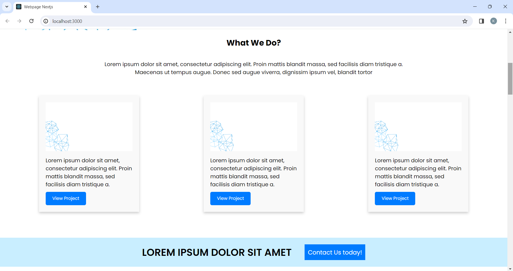
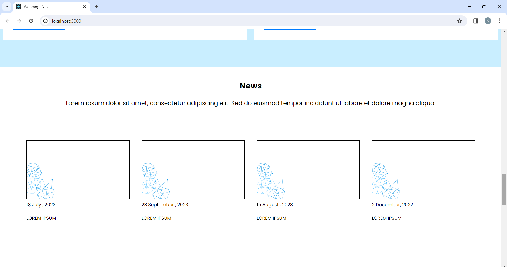
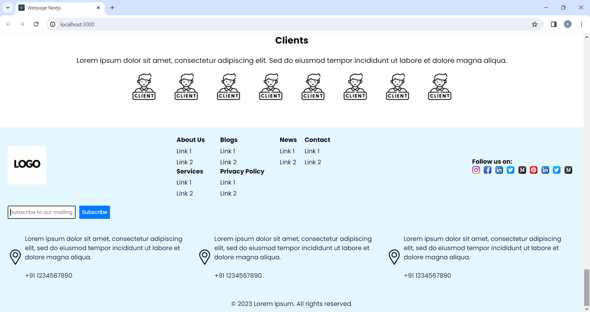

# Next.js Project

This is a sample Next.js project with a basic structure for a website. It includes a homepage with a navigation bar, sections for "What We Do," "Initiatives," "News," "Stories," and "Clients."

## Screenshots








## How to Run

### Prerequisites

Make sure you have [Node.js](https://nodejs.org/) installed on your machine.

### Steps

1. **Clone the Repository**

    ```bash
    git clone https://github.com/kareenamatwani/your-nextjs-project.git
    cd to root directory where node modules are installed
    ```

2. **Install Dependencies**

    ```bash
    npm install
    ```

3. **Run the Development Server**

    ```bash
    npm run dev
    ```

    This will start the development server. Open your browser and visit [http://localhost:3000](http://localhost:3000) to view your Next.js application.


